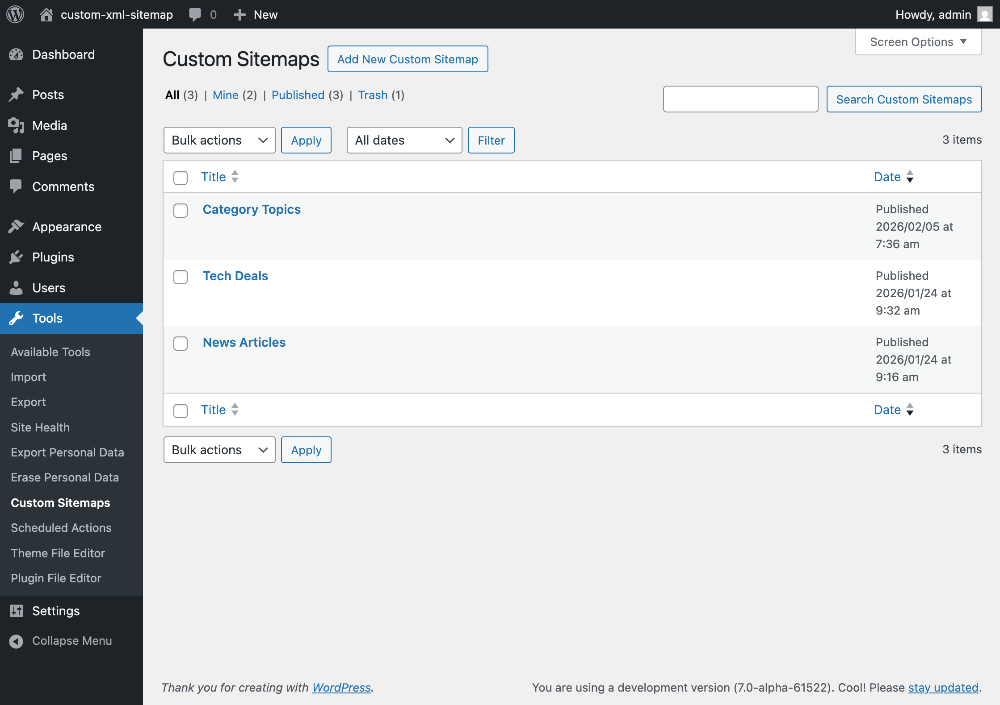
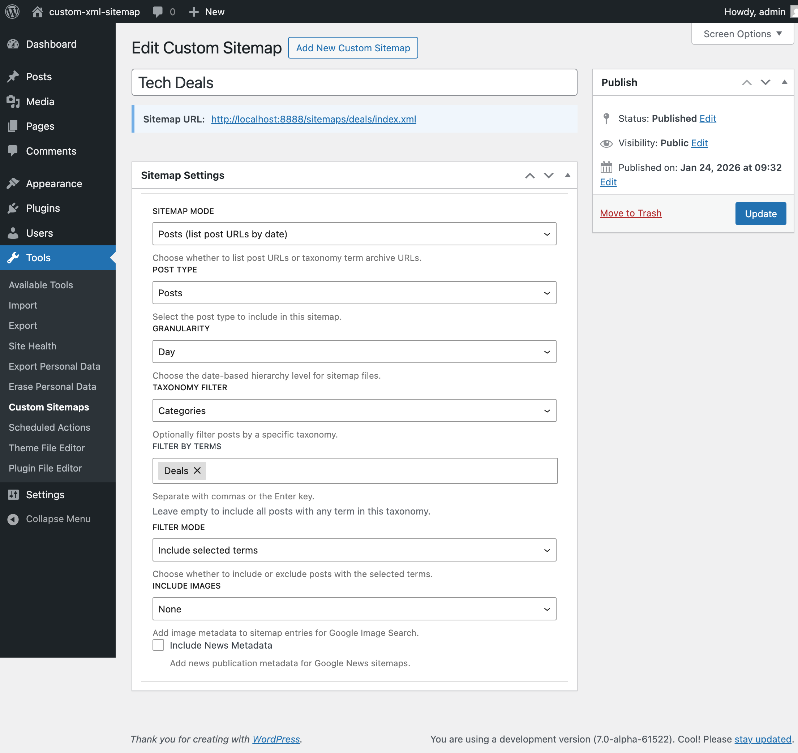
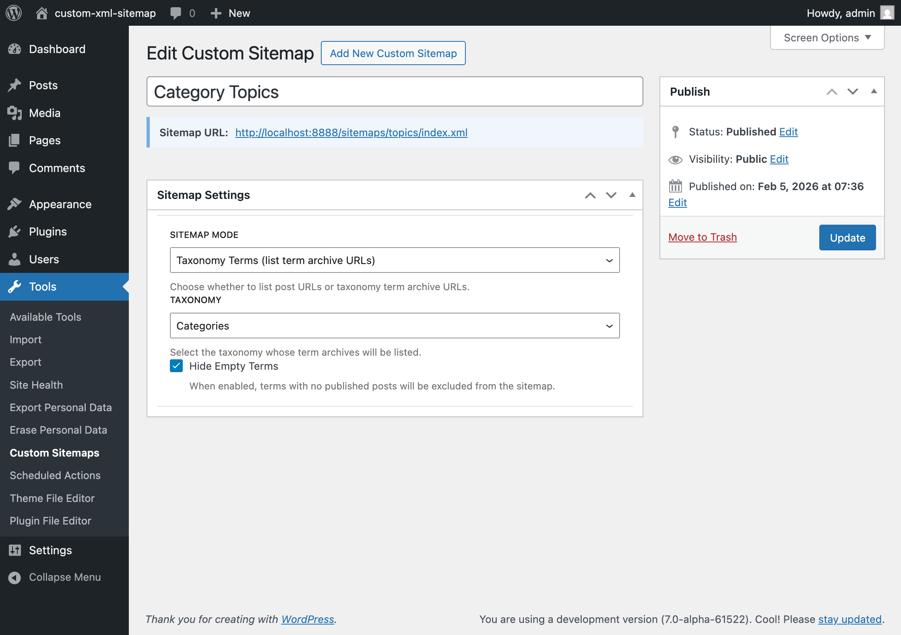
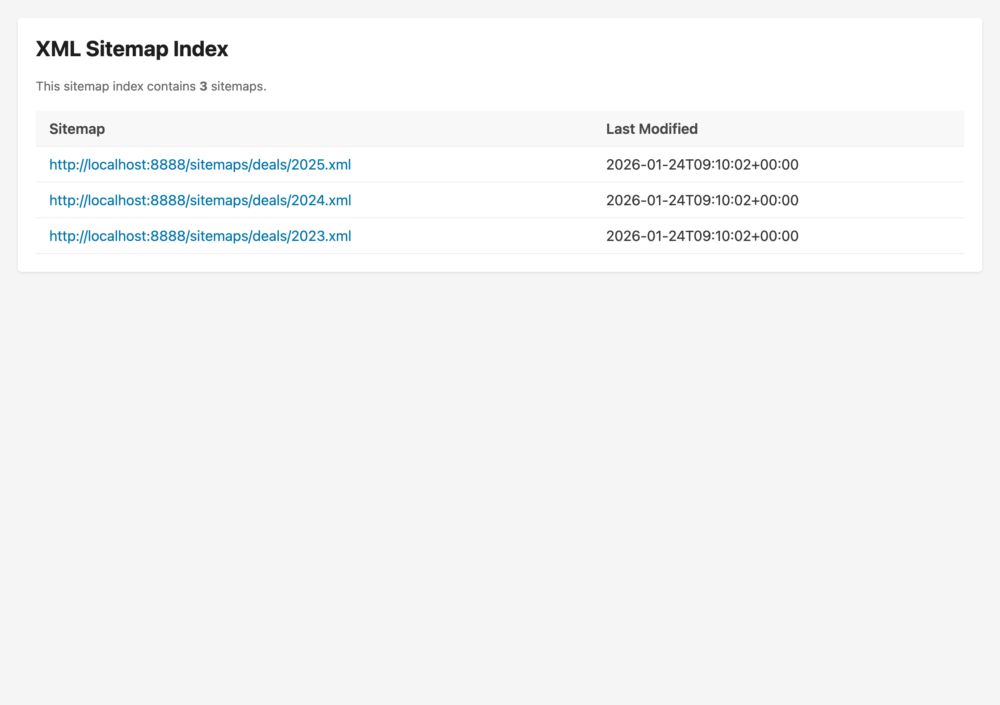
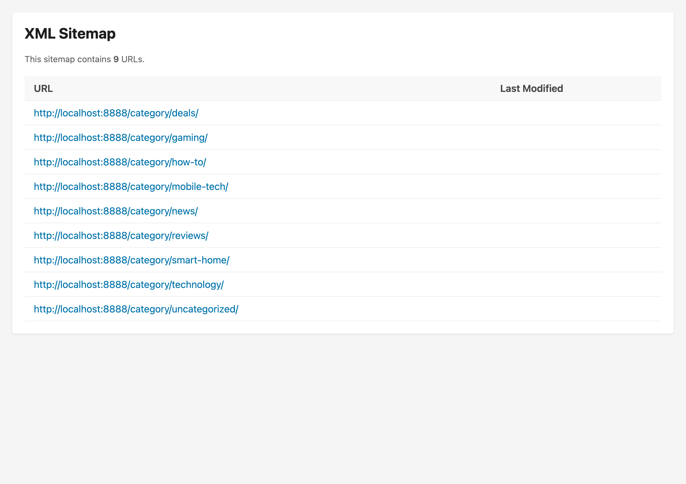

# Custom XML Sitemap

[](https://github.com/xwp/custom-xml-sitemap/actions/workflows/test.yml)
[](https://packagist.org/packages/xwp/custom-xml-sitemap)
[](https://github.com/xwp/custom-xml-sitemap/blob/main/composer.json)
[](https://packagist.org/packages/xwp/custom-xml-sitemap)

A WordPress plugin that generates taxonomy-filtered, hierarchical XML sitemaps with configurable time-based granularity (year / month / day) and a separate Terms mode for taxonomy archive sitemaps. Built for high-traffic publishers on WordPress VIP, with Action Scheduler–backed regeneration, a Memcached-safe XML cache, and a React-based admin UI.

> [!IMPORTANT]
> **Best suited for WordPress VIP (or any environment with a reliable background job runner).**
>
> This plugin relies on [Action Scheduler](https://actionscheduler.org/) to regenerate sitemap XML asynchronously when content changes. Sitemap files are never built inline during a front-end request; they're written ahead of time by Action Scheduler workers and served from cached post meta.
>
> If Action Scheduler isn't being driven by a real scheduler (WP VIP cron, a system cron hitting `wp action-scheduler run`, or equivalent), sitemap output **will become stale or stop updating entirely**. The default WP-Cron is best-effort and depends on front-end traffic; it works for low-volume sites but is not recommended for production.
>
> See the [Requirements](#requirements) section for setup details.

## Screenshots

<details>
<summary>Sitemap list: all configured sitemaps at a glance</summary>



</details>

<details>
<summary>Sitemap editor: Posts mode with taxonomy filter and filter mode</summary>



</details>

<details>
<summary>Sitemap editor: Terms mode for taxonomy archive sitemaps</summary>



</details>

<details>
<summary>Rendered XML sitemap index (styled with XSL)</summary>



</details>

<details>
<summary>Terms sitemap output listing category archive URLs</summary>



</details>

## How it Works

The plugin creates a custom post type for defining sitemap configurations. Each sitemap can target a specific post type, filter by taxonomy terms, and split content by year, month, or day granularity. Generated XML is cached and served via custom rewrite rules with XSL stylesheets for browser-friendly display.

Key features:
- **Taxonomy Filtering** - Filter sitemap content by categories, tags, or custom taxonomies
- **Configurable Granularity** - Split sitemaps by year, month, or day
- **Hierarchical Structure** - Index sitemap links to year sitemaps, which link to month/day sitemaps
- **Auto-Regeneration** - Automatic updates via Action Scheduler when content changes
- **robots.txt Integration** - Automatically adds sitemap references
- **Image Sitemap Support** - Include images in sitemap entries for Google Image Search
- **News Sitemap Support** - Add Google News publication metadata for news sitemaps

## Sitemap Configuration

Each sitemap is configured via the **Sitemap Settings** metabox in the editor. The available fields depend on the selected mode.

### Posts Mode

| Field | Description |
|-------|-------------|
| **Post Type** | The post type to include (e.g. Posts, Pages) |
| **Granularity** | Date hierarchy: Year, Month, or Day |
| **Taxonomy Filter** | Optionally restrict by a taxonomy (Categories, Tags, or custom) |
| **Filter by Terms** | One or more specific terms to match |
| **Filter Mode** | **Include** (only posts with selected terms) or **Exclude** (all posts except those with selected terms) |
| **Include Images** | None / Featured Image Only / All Images |
| **Include News Metadata** | Adds Google News `<news:news>` elements |

Leave **Filter by Terms** empty to include all posts regardless of term assignment.

## Image and News Sitemaps

### Image Sitemaps

Enable image metadata in your sitemaps to help Google discover images on your pages. Three modes are available:

| Mode | Description |
|------|-------------|
| **None** | No images included (default) |
| **Featured Image Only** | Include only the post's featured image |
| **All Images** | Include featured image + images from post content |

When enabled, the sitemap includes `<image:image>` elements with `<image:loc>` for each image URL:

```xml
<url>
  <loc>https://example.com/post/</loc>
  <lastmod>2024-01-15T10:30:00+00:00</lastmod>
  <image:image>
    <image:loc>https://example.com/wp-content/uploads/photo.jpg</image:loc>
  </image:image>
</url>
```

Image extraction supports:
- Featured images
- Gutenberg `core/image` blocks
- Classic editor inline `` tags
- Custom blocks via the `cxs_extract_block_images` filter

### News Sitemaps

Enable news metadata for Google News sitemaps. When enabled, each URL entry includes publication details:

```xml
<url>
  <loc>https://example.com/breaking-news/</loc>
  <news:news>
    <news:publication>
      <news:name>Example Times</news:name>
      <news:language>en</news:language>
    </news:publication>
    <news:publication_date>2024-01-15T10:30:00+00:00</news:publication_date>
    <news:title>Breaking News Story</news:title>
    <news:keywords>Technology, Innovation</news:keywords>
  </news:news>
</url>
```

News metadata includes:
- **Publication name** - From site name (trailing parentheticals stripped per Google spec)
- **Language code** - ISO 639 format from WordPress locale
- **Publication date** - ISO 8601 format from post date
- **Title** - Post title
- **Keywords** - Categories and tags (excluding "Uncategorized")

## Terms Mode (Taxonomy Archive Sitemaps)

In addition to post-based sitemaps, the plugin supports **Terms Mode** which generates sitemaps listing taxonomy term archive URLs (e.g., `/topics/gaming/`, `/category/tech/`) instead of individual post URLs.

### When to Use Terms Mode

Terms mode is useful when you want search engines to index your taxonomy archive pages:
- Topic/category landing pages
- Tag archives with curated content
- Custom taxonomy term pages

### Configuration

1. Create a new sitemap under **Tools > Custom Sitemaps**
2. Set **Sitemap Mode** to "Taxonomy Terms"
3. Select the **Taxonomy** to include (required)
4. Optionally enable **Hide Empty Terms** to exclude terms with no published posts

### URL Structure

Terms mode sitemaps use a paginated structure:

| URL Pattern | Description |
|-------------|-------------|
| `/sitemaps/{slug}/index.xml` | Index sitemap (for >1000 terms) or direct URL list |
| `/sitemaps/{slug}/page-1.xml` | First page of term URLs (1000 terms max per page) |
| `/sitemaps/{slug}/page-2.xml` | Second page, etc. |

For taxonomies with 1000 or fewer terms, the index.xml contains all term URLs directly. For larger taxonomies, the index.xml becomes a sitemap index linking to paginated sitemaps.

### Example Output

**Index sitemap (small taxonomy):**
```xml
<?xml version="1.0" encoding="UTF-8"?>
<urlset xmlns="http://www.sitemaps.org/schemas/sitemap/0.9">
  <url>
    <loc>https://example.com/topics/gaming/</loc>
  </url>
  <url>
    <loc>https://example.com/topics/technology/</loc>
  </url>
</urlset>
```

**Index sitemap (large taxonomy with pagination):**
```xml
<?xml version="1.0" encoding="UTF-8"?>
<sitemapindex xmlns="http://www.sitemaps.org/schemas/sitemap/0.9">
  <sitemap>
    <loc>https://example.com/sitemaps/topics/page-1.xml</loc>
  </sitemap>
  <sitemap>
    <loc>https://example.com/sitemaps/topics/page-2.xml</loc>
  </sitemap>
</sitemapindex>
```

### Behavioral Notes

- Terms mode sitemaps do **not** include `<lastmod>` elements (term archives have no inherent modification date)
- Terms are ordered alphabetically by name
- Automatic regeneration is triggered when terms are created, edited, or deleted (with 5-minute debounce)
- Image and News options are not applicable in Terms mode

## Requirements

- PHP 8.4+
- WordPress 6.0+
- [Action Scheduler](https://actionscheduler.org/) (bundled with the plugin via Composer)
- Pretty permalinks enabled

### Action Scheduler must be running

All XML generation happens off-request, inside Action Scheduler jobs. The plugin schedules:

- A **recurring job** per published sitemap (regenerates the full set of buckets on a configurable cadence)
- **On-change jobs** triggered by post/term saves, deletes, and meta updates (with a 5-minute debounce per sitemap)

If Action Scheduler isn't being processed, none of those jobs run and the cached XML will go stale. The first request after activation will trigger a queue, but ongoing updates depend on a live worker.

#### WordPress VIP (recommended)

VIP runs Action Scheduler under its managed cron infrastructure. No additional setup is required; install, activate, configure sitemaps, and the platform handles the rest.

#### Self-hosted / non-VIP

You need to drive Action Scheduler explicitly. Pick **one** of:

- **System cron (recommended for production)**: schedule a frequent CLI invocation:

  ```cron
  * * * * * cd /path/to/wordpress && wp action-scheduler run --batch-size=50 --batches=5 >/dev/null 2>&1
  ```

- **Long-running worker**: run continuously via a process supervisor (systemd, supervisord, etc.):

  ```bash
  wp action-scheduler run --batch-size=50 --batches=0
  ```

- **WP-Cron (low-traffic sites only)**: works out of the box but only fires on front-end requests. Not recommended for production: a low-traffic site can lag arbitrarily, and a site that's entirely behind a cache may never trigger it. To use this, ensure `DISABLE_WP_CRON` is unset.

To verify the queue is being drained, watch **Tools → Scheduled Actions** in the WP admin or run `wp action-scheduler status`.

## Installation

### Via Composer (Recommended)

```bash
composer require xwp/custom-xml-sitemap
```

The plugin and its dependencies (Action Scheduler) will be installed automatically.

### Manual Installation

1. Download the latest release zip from [GitHub Releases](https://github.com/xwp/custom-xml-sitemap/releases)
2. Upload the zip file via **Plugins > Add New > Upload Plugin** in WordPress admin
3. Activate the plugin through the 'Plugins' menu

### From Source

```bash
# Clone the repository
git clone https://github.com/xwp/custom-xml-sitemap.git

# Install dependencies
cd custom-xml-sitemap
composer install
pnpm install

# Build assets
pnpm run build
```

Then copy the plugin folder to `/wp-content/plugins/` and activate.

### After Installation

Navigate to **Tools > Custom Sitemaps** in the WordPress admin to create your first sitemap.

## Sitemap URLs

Once a sitemap is published, it's accessible at the following URLs.

**Posts Mode (default):**
```
/sitemaps/{slug}/index.xml              # Main index
/sitemaps/{slug}/{year}.xml             # Year index
/sitemaps/{slug}/{year}/{month}.xml     # Month sitemap (monthly granularity)
/sitemaps/{slug}/{year}/{month}/{day}.xml  # Day sitemap (daily granularity)
```

**Terms Mode:**
```
/sitemaps/{slug}/index.xml              # Index or direct URL list
/sitemaps/{slug}/page-{n}.xml           # Paginated term URLs (for large taxonomies)
```

## WP-CLI Commands

### List Sitemaps
```bash
wp cxs list [--format=<table|json|csv>]
```

Displays all configured sitemaps with columns: ID, Slug, Post Type, Taxonomy, **Mode**, Status, and URL Count.

### Generate Sitemaps
```bash
wp cxs generate [<sitemap-slug>] [--all] [--year=<year>] [--dry-run]
```

### Show Statistics
```bash
wp cxs stats [<sitemap-slug>] [--format=<table|json|csv>]
```

### Validate Sitemaps
```bash
wp cxs validate <sitemap-slug> [--verbose]
```

## Developer Hooks

### `cxs_sitemap_skip_post`
Skip a post when emitting urlset entries. Return `true` to omit the post (and any image/news extensions) from the generated XML. Useful for excluding noindex posts, paywalled content, or posts that fail an external policy check.

```php
add_filter( 'cxs_sitemap_skip_post', function( $skip, $post_id ) {
    if ( 'noindex' === get_post_meta( $post_id, 'robots_directive', true ) ) {
        return true;
    }
    return $skip;
}, 10, 2 );
```

Filtering happens at XML output time, not at the query level, so date-bucket counts and `<lastmod>` values in sitemap indexes may still reflect skipped posts. This is an intentional trade-off to avoid `meta_query` JOINs that hurt generation throughput.

### `cxs_extract_block_images`
Extract images from custom Gutenberg blocks for image sitemaps.

```php
add_filter( 'cxs_extract_block_images', function( $images, $block_name, $block, $post_id ) {
    if ( 'acme/gallery' === $block_name ) {
        // Extract images from custom gallery block
        $gallery_ids = $block['attrs']['imageIds'] ?? [];
        foreach ( $gallery_ids as $id ) {
            $url = wp_get_attachment_image_url( $id, 'full' );
            if ( $url ) {
                $images[] = [ 'url' => $url ];
            }
        }
    }
    return $images;
}, 10, 4 );
```

### `cxs_excluded_post_types`
Remove post types from appearing in the sitemap **Post Type** dropdown.

```php
add_filter( 'cxs_excluded_post_types', function( $excluded ) {
    $excluded[] = 'page';
    return $excluded;
} );
```

### `cxs_excluded_taxonomies`
Remove taxonomies from the **Taxonomy Filter** and **Terms Mode** dropdowns.

```php
add_filter( 'cxs_excluded_taxonomies', function( $excluded ) {
    $excluded[] = 'post_format';
    return $excluded;
} );
```

## Local Development & Testing

### Installation
```bash
composer install
pnpm install
```

### Running Tests
```bash
# Start wp-env Docker environment
pnpm env:start

# Run PHPUnit tests
pnpm run test:php

# Run PHP Code Sniffer
composer lint

# Run PHPStan
composer phpstan
```

### Build Assets
```bash
pnpm run build
```

## License

GPLv2 or later.
